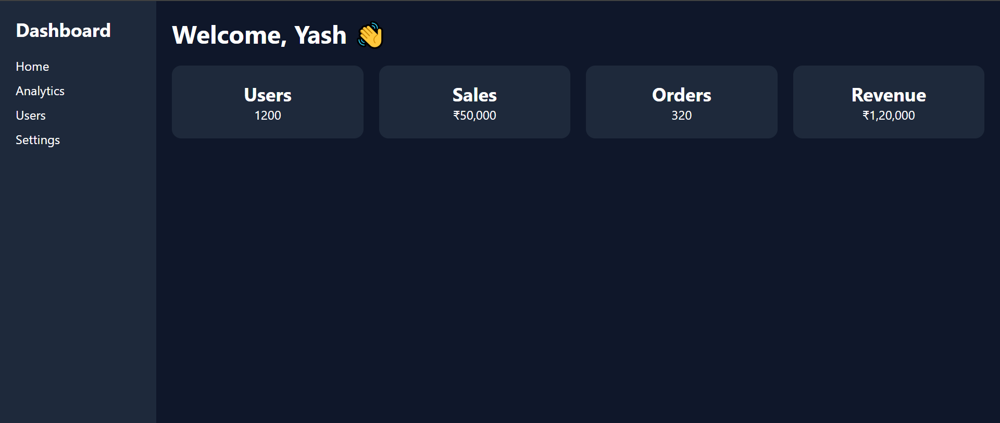

# 📊 Dashboard UI - Day 1 Project 6

## 📌 Project Overview

This project is a modern **Dashboard UI (Admin Panel)** created as part of my semester challenge to build 200 websites.

It represents a real-world admin interface with a sidebar, header, and data cards to display important information.

---

## 🎯 Features

* 📌 Sidebar Navigation Menu
* 📊 Dashboard Cards (Users, Sales, Orders, Revenue)
* 📋 Header Section
* 📱 Responsive Grid Layout
* 🎨 Clean and Professional UI

---

## 🛠️ Technologies Used

* HTML5
* CSS3 (Flexbox + Grid)

---

## 📂 Project Structure

```
site-6-dashboard/
│
├── index.html
├── style.css
├── preview.png
└── README.md
```

---

## 📸 Preview

> ⚠️ Make sure `preview.png` is uploaded in the same folder



---

## 💡 Learning Outcome

* Learned dashboard layout design
* Used Flexbox and Grid together
* Built sidebar navigation
* Improved UI structuring skills
* Practiced Git & GitHub workflow

---

## 🔥 Author

**Yash Patil**
Future Data Engineer 🚀

---

## ⭐ Note

This project is part of my goal to build **200 websites** to improve my development and design skills.
